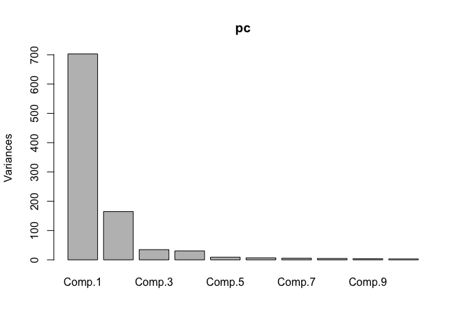

Clusters
================

Construcción de clusters con las observaciones de 41 estaciones en CA
=====================================================================

Existen muchas opciones para agrupar los caudales de las estaciones, así que se elige trabajar con 3:

-   Distancia univariada de las variancias de cada estación.
-   k-means usando los primeros componentes de PCA.
-   Cluster para las series de tiempo utilizando <https://www.jstatsoft.org/article/view/v062i01/v62i01.pdf>

Los datos
---------

Los datos consisten en observaciones mensuales de cuadal en 74 estaciones: las fechas de observación van desde enero de 1969 hasta diciembre de 1979. Cada estación representa una cuenca hidrológica en Centro América, y en total se tienen observaciones de 12 meses en cada uno de los 11 años para 74 locaciones. También, se tienen datos de climatología mensual para cada una de las estaciones.

    ## [1] 132  74

    ## [1] 12 74

Las locaciones de las estaciones se pueden apreciar en el siguiente mapa:

    ## [1] 74  4

    ##      left    bottom     right       top 
    ## -112.1223    5.6804  -75.2067   31.9196

    ## converting bounding box to center/zoom specification. (experimental)

    ## Map from URL : http://maps.googleapis.com/maps/api/staticmap?center=18.8,-93.6645&zoom=5&size=640x640&scale=2&maptype=terrain&language=en-EN&sensor=false


Como las locaciones incluyen varias estaciones en el Norte de México, se realiza un corte en la latitud 20 y en la longitud -100, para obtener 41 estaciones localizadas en Centroamérica:

    ## [1] 41  4

    ##      left    bottom     right       top 
    ## -101.7405    6.7175  -76.1505   20.5115

    ## converting bounding box to center/zoom specification. (experimental)

    ## Map from URL : http://maps.googleapis.com/maps/api/staticmap?center=13.6145,-88.9455&zoom=5&size=640x640&scale=2&maptype=terrain&language=en-EN&sensor=false


Clustering
----------

-   OPCIÓN 1: Utilizar las variancias y luego agrupar por magnitud.

``` r
caudal2 <- caudal[,-c(1:3)][,estaciones]
aa<-round(c(apply(caudal2,2,var)),4)
loca$rank_var <- cut_number(aa,5)
sq_map <- get_map(location = sbbox, maptype = "satellite", source = "google")
```

    ## converting bounding box to center/zoom specification. (experimental)

    ## Map from URL : http://maps.googleapis.com/maps/api/staticmap?center=13.6145,-88.9455&zoom=5&size=640x640&scale=2&maptype=satellite&language=en-EN&sensor=false

``` r
ggmap(sq_map) + geom_point(data = loca, mapping = aes(x = Longitud, y = Latitud, colour=rank_var))
```


Descripción de los clusters:

``` r
medianas <- apply(caudal2,2,median)
data <- as_tibble(cbind(loca,medianas))
names(data) <- c("cod","lat","lon","area","rank_var","Mediana_de_cluster")
## Area promedio de cada cluster:
as.integer(tapply(data$area, data$rank_var,mean))
```

    ## [1]      5452      6800      7414      2336 150501132

``` r
## Mediana del Caudal de cada cluster:                                         
round(tapply(data$Mediana_de_cluster, data$rank_var,median),4)
```

    ##    [0,0.868] (0.868,3.16]     (3.16,7]     (7,23.6]   (23.6,113] 
    ##       0.2100       0.6966       1.2184       2.9613       5.8753

``` r
matplot(caudal2,type="l", col=data$rank_var)
legend("topright", levels(data$rank_var),col=1:5,cex=0.8,fill=1:5)
```


-   OPCIÓN 2: k-means usando los componentes de PCA.

Primero, se deben calcular los PCA utilizando las anomalías en lugar de las observaciones. Como se tiene la climatología mensual para cada locación, el cálculo consiste en restar la climatología mensual a cada observación, según el mes correspondiente. Luego, se procede a hacer el PCA y por último agrupar las estaciones utilizando k-means de los primeros 10 componentes.

``` r
clima2 <- (as.matrix(clima[,-1]) %x% rep(1, 11))[,estaciones]
anomalies <- caudal2-clima2
pc <- princomp(anomalies)
plot(pc)
```



``` r
mydata <- (pc$loadings[,1:10])
fit <- kmeans(mydata, 6) 
aggregate(mydata,by=list(fit$cluster),FUN=mean)
```

    ##   Group.1      Comp.1      Comp.2      Comp.3      Comp.4     Comp.5
    ## 1       1 -0.10973640  0.04393558 -0.10629680 -0.10949366 0.06474048
    ## 2       2 -0.12027666 -0.10233604 -0.28608561  0.10603650 0.02683884
    ## 3       3 -0.24592266  0.91456306 -0.16664605  0.07449124 0.03767719
    ## 4       4 -0.21288492 -0.02967169  0.37340500  0.76764079 0.37206089
    ## 5       5 -0.09231858 -0.03029836  0.01572769 -0.01061581 0.02631886
    ## 6       6 -0.37626234 -0.06992115  0.06207704 -0.19469820 0.01050676
    ##        Comp.6       Comp.7       Comp.8       Comp.9       Comp.10
    ## 1  0.13345508 -0.147804567  0.356004204  0.054073415  0.2313946438
    ## 2 -0.01058128  0.108502863 -0.045613799 -0.048656972  0.0003403794
    ## 3 -0.11972971  0.009819237 -0.093040079 -0.003632703 -0.0027044916
    ## 4  0.22721034 -0.086379727  0.088968248  0.013361527 -0.0136745190
    ## 5 -0.10579645 -0.023716453  0.006606544 -0.032170181  0.0134004947
    ## 6  0.27822100 -0.054305194 -0.336906070  0.211989055  0.0261137531

``` r
loca <- data.frame(loca, cluster=fit$cluster)
ggmap(sq_map) + geom_point(data = loca, mapping = aes(x = Longitud, y = Latitud, colour=as.character(cluster)))
```


Descripción de los clusters:

``` r
data <- as_tibble(cbind(loca,medianas))
names(data) <- c("cod","lat","lon","area","rank_var","cluster2","Mediana_de_cluster")
## Area promedio de cada cluster:
round(as.integer(tapply(data$area,data$cluster2,mean)),0)
```

    ## [1]       787      7266        73       200      5106 602000668

``` r
## Medianan del Caudal de cada cluster:                                         
round(tapply(data$Mediana_de_cluster, data$cluster2,median),4)
```

    ##      1      2      3      4      5      6 
    ## 1.8932 1.8953 9.4685 4.7279 0.6966 9.0093

``` r
matplot(caudal2,type="l", col=data$cluster2)
legend("topright", levels(as.factor(data$cluster2)),col=1:6,cex=0.8,fill=1:6)
```


-   OPCIÓN 3: Cluster para las series de tiempo.

En este caso también se deben calcular las anomalías. Luego, se procede a aplicar el algoritmo de TSclust, que se describe aquí: <https://www.jstatsoft.org/article/view/v062i01/v62i01.pdf>

``` r
dpred <- diss(anomalies, "ACF", p=0.05)
hc.pred <- hclust(dpred)
plot(hc.pred)
```


``` r
aa<-cutree(hc.pred, k = 6)
loca <- data.frame(loca, clusterTS=aa )
ggmap(sq_map) + geom_point(data = loca, mapping = aes(x = Longitud, y = Latitud, colour=as.character(clusterTS)))
```


Descripción de los clusters:

``` r
data <- as_tibble(cbind(loca,medianas))
names(data) <- c("cod","lat","lon","area","rank_var","cluster2","clusterTS", "Mediana_de_cluster")
## Area promedio de cada cluster:
as.integer(tapply(data$area, data$clusterTS,mean))
```

    ## [1]     8372 80271495     3563     2686      836     1487

``` r
## Mediana del Caudal de cada cluster:                                         
round(tapply(data$Mediana_de_cluster, data$clusterTS,median),4)
```

    ##      1      2      3      4      5      6 
    ## 1.0043 4.1007 0.2885 0.2879 1.4182 5.0170

``` r
matplot(caudal2,type="l", col=data$clusterTS)
legend("topright", levels(as.factor(data$clusterTS)),col=1:6,cex=0.8,fill=1:6)
```


