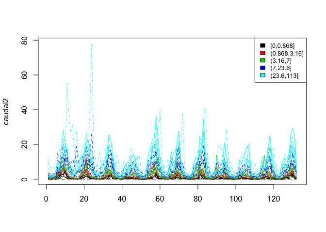

Clusters
================

Construcción de clusters con las observaciones de 74 estaciones en CA
=====================================================================

Existen muchas opciones para agrupar los caudales de las estaciones, así que se elige trabajar con 3:

-   Distancia univariada de las variancias de cada estación.
-   k-means usando los primeros componentes de PCA.
-   Cluster para las series de tiempo utilizando <https://www.jstatsoft.org/article/view/v062i01/v62i01.pdf>

Los datos
---------

Los datos consisten en observaciones mensuales de cuadal en 74 estaciones: las fechas de observación van desde enero de 1969 hasta diciembre de 1979. Cada estación representa una cuenca hidrológica en Centro América, y en total se tienen observaciones de 12 meses en cada uno de los 11 años para 74 locaciones. También, se tienen datos de climatología mensual para cada una de las estaciones.

    ## [1] 132  74

    ## [1] 12 74

Las locaciones de las estaciones se pueden apreciar en el siguiente mapa:

    ## [1] 74  4

    ##      left    bottom     right       top 
    ## -112.1223    5.6804  -75.2067   31.9196

    ## converting bounding box to center/zoom specification. (experimental)

    ## Map from URL : http://maps.googleapis.com/maps/api/staticmap?center=18.8,-93.6645&zoom=5&size=640x640&scale=2&maptype=terrain&language=en-EN&sensor=false


Clustering
----------

-   OPCIÓN 1: Utilizar las variancias y luego agrupar por magnitud.

``` r
aa<-round(c(apply(caudal[,-c(1:3)],2,var)),4)
loca$rank_var <- cut_number(aa,5)
sq_map <- get_map(location = sbbox, maptype = "satellite", source = "google")
```

    ## converting bounding box to center/zoom specification. (experimental)

    ## Map from URL : http://maps.googleapis.com/maps/api/staticmap?center=18.8,-93.6645&zoom=5&size=640x640&scale=2&maptype=satellite&language=en-EN&sensor=false

``` r
ggmap(sq_map) + geom_point(data = loca, mapping = aes(x = Longitud, y = Latitud, colour=rank_var))
```


Descripción de los clusters:

``` r
medianas <- apply(caudal[,-c(1:3)],2,median)
data <- as_tibble(cbind(loca,medianas))
names(data) <- c("cod","lat","lon","area","rank_var","Mediana_de_cluster")
## Area promedio de cada cluster:
round(tapply(data$area, data$rank_var,mean),4)
```

    ##     [0,0.19]  (0.19,0.71]  (0.71,3.14]  (3.14,9.64]   (9.64,113] 
    ##    54370.667     9323.790     4055.396     6172.333 80268425.533

``` r
## Mediana del Caudal de cada cluster:                                         
round(tapply(data$Mediana_de_cluster, data$rank_var,median),4)
```

    ##    [0,0.19] (0.19,0.71] (0.71,3.14] (3.14,9.64]  (9.64,113] 
    ##      0.0215      0.1631      0.4938      1.2625      4.7279

-   OPCIÓN 2: k-means usando los componentes de PCA.

Primero, se deben calcular los PCA utilizando las anomalías en lugar de las observaciones. Como se tiene la climatología mensual para cada locación, el cálculo consiste en restar la climatología mensual a cada observación, según el mes correspondiente. Luego, se procede a hacer el PCA y por último agrupar las estaciones utilizando k-means.

``` r
clima2 <- as.matrix(clima[,-1]) %x% rep(1, 11)
anomalies <- caudal[,-c(1:3)]-clima2
pc <- princomp(anomalies)
plot(pc)
```



``` r
mydata <- (pc$loadings[,1:10])
fit <- kmeans(mydata, 6) 
aggregate(mydata,by=list(fit$cluster),FUN=mean)
```

    ##   Group.1      Comp.1      Comp.2       Comp.3      Comp.4      Comp.5
    ## 1       1 -0.03236753  0.02003948 -0.052705757 -0.01155176 -0.03723761
    ## 2       2 -0.09226363  0.10238656 -0.249245515 -0.01029817  0.31521900
    ## 3       3 -0.31486547  0.03354574  0.149833574 -0.16014539  0.08677194
    ## 4       4 -0.07378654  0.05579737 -0.063748735  0.04383224  0.09371667
    ## 5       5 -0.08035949  0.02079995  0.001412865  0.03520990  0.02090186
    ## 6       6 -0.21944872 -0.14916599  0.071209607 -0.03162633 -0.09476993
    ##        Comp.6       Comp.7      Comp.8       Comp.9     Comp.10
    ## 1 -0.01263461  0.005131228 -0.03860683  0.006903447  0.01340550
    ## 2 -0.23821138 -0.012421407  0.05428449 -0.162107082 -0.02525471
    ## 3  0.06522142  0.265201443  0.11074939  0.125737832 -0.16811471
    ## 4  0.15461689 -0.036529076  0.09287214  0.059983120  0.14240901
    ## 5  0.10697671 -0.108308240 -0.06202052 -0.080938962 -0.11137158
    ## 6 -0.09913274 -0.138107310  0.07959327 -0.102756546  0.09585316

``` r
loca <- data.frame(loca, cluster=fit$cluster)
ggmap(sq_map) + geom_point(data = loca, mapping = aes(x = Longitud, y = Latitud, colour=as.character(cluster)))
```


Descripción de los clusters:

``` r
data <- as_tibble(cbind(loca,medianas))
names(data) <- c("cod","lat","lon","area","rank_var","cluster2","Mediana_de_cluster")
## Area promedio de cada cluster:
round(tapply(data$area, data$cluster2,mean),4)
```

    ##            1            2            3            4            5 
    ## 2.523472e+04 1.454000e+03 4.013338e+08 8.170400e+03 2.446700e+03 
    ##            6 
    ## 8.013333e+02

``` r
## Medianan del Caudal de cada cluster:                                         
round(tapply(data$Mediana_de_cluster, data$cluster2,median),4)
```

    ##      1      2      3      4      5      6 
    ## 0.1344 0.9366 8.9766 1.2963 0.7304 4.2840

-   OPCIÓN 3: Cluster para las series de tiempo.

En este caso también se deben calcular las anomalías. Luego, se procede a aplicar el algoritmo de TSclust, que se describe aquí: <https://www.jstatsoft.org/article/view/v062i01/v62i01.pdf>

``` r
dpred <- diss(anomalies, "ACF", p=0.05)
hc.pred <- hclust(dpred)
plot(hc.pred)
```


``` r
aa<-cutree(hc.pred, k = 6)
loca <- data.frame(loca, clusterTS=aa )
ggmap(sq_map) + geom_point(data = loca, mapping = aes(x = Longitud, y = Latitud, colour=as.character(clusterTS)))
```


Descripción de los clusters:

``` r
data <- as_tibble(cbind(loca,medianas))
names(data) <- c("cod","lat","lon","area","rank_var","cluster2","clusterTS", "Mediana_de_cluster")
## Area promedio de cada cluster:
round(tapply(data$area, data$clusterTS,mean),4)
```

    ##            1            2            3            4            5 
    ##    12408.600   111564.200     4427.158    13718.250     8339.222 
    ##            6 
    ## 70828364.091

``` r
## Mediana del Caudal de cada cluster:                                         
round(tapply(data$Mediana_de_cluster, data$cluster2,median),4)
```

    ##      1      2      3      4      5      6 
    ## 0.1344 0.9366 8.9766 1.2963 0.7304 4.2840
