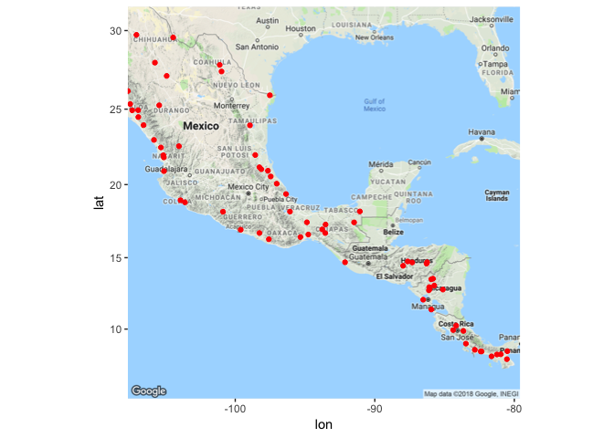
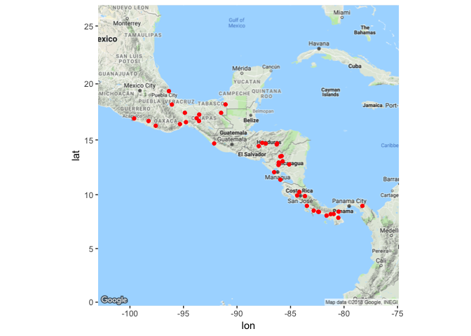
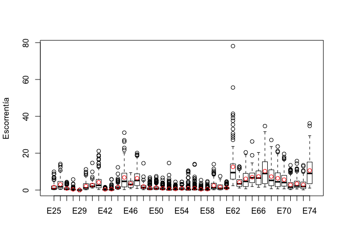
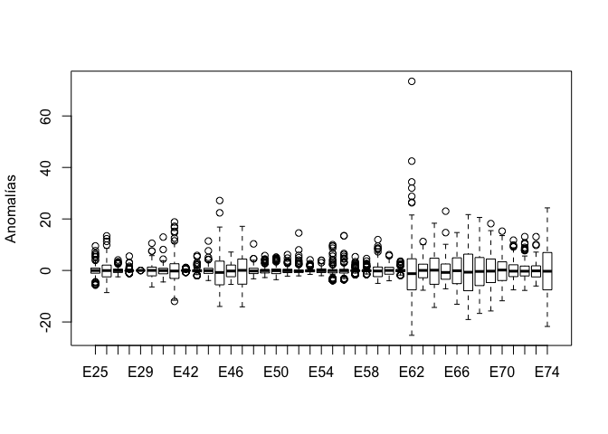
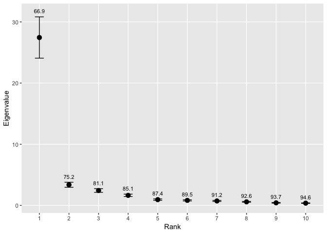
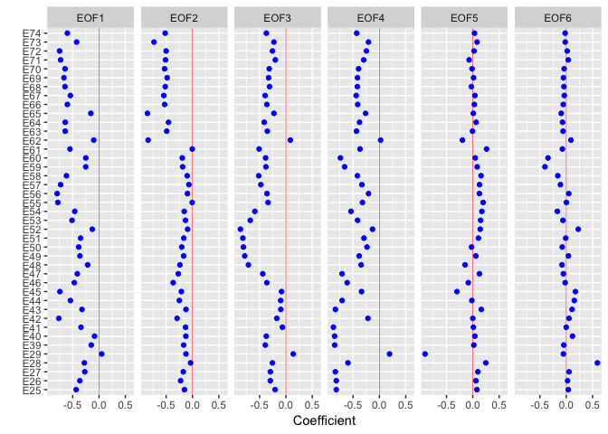
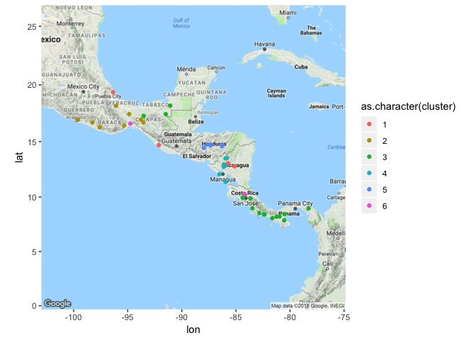
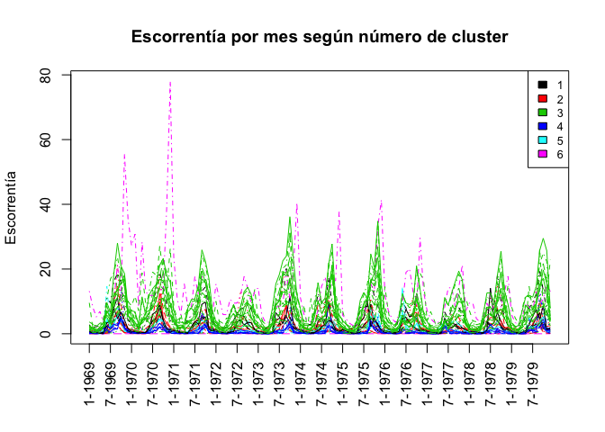
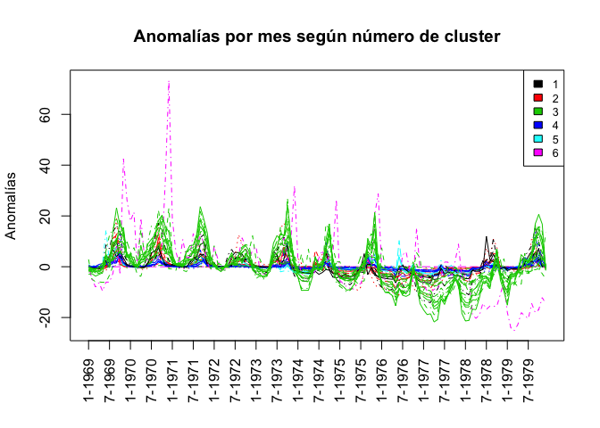

Clusters
================

Los datos
---------

Los datos consisten en observaciones mensuales de cuadal en 74 estaciones: las fechas de observación van desde enero de 1969 hasta diciembre de 1979. Cada estación representa una cuenca hidrológica en Centro América, y en total se tienen observaciones de 12 meses en cada uno de los 11 años para 74 locaciones. También, se tienen datos de climatología mensual para cada una de las estaciones.

    ## [1] 132  74

    ## [1] 12 74

Las locaciones de las estaciones se pueden apreciar en el siguiente mapa:

    ## [1] 74  4

    ##      left    bottom     right       top 
    ## -112.1223    5.6804  -75.2067   31.9196

    ## converting bounding box to center/zoom specification. (experimental)

    ## Map from URL : http://maps.googleapis.com/maps/api/staticmap?center=18.8,-93.6645&zoom=5&size=640x640&scale=2&maptype=terrain&language=en-EN&sensor=false



Como las locaciones incluyen varias estaciones en el Norte de México, se realiza un corte en la latitud 20 y en la longitud -100, para obtener 41 estaciones localizadas en Centroamérica:

    ## [1] 41  4

    ##      left    bottom     right       top 
    ## -101.7405    6.7175  -76.1505   20.5115

    ## converting bounding box to center/zoom specification. (experimental)

    ## Map from URL : http://maps.googleapis.com/maps/api/staticmap?center=13.6145,-88.9455&zoom=5&size=640x640&scale=2&maptype=terrain&language=en-EN&sensor=false



Estadística descriptiva de las 41 estaciones.
---------------------------------------------

``` r
caudalt <- caudal %>% gather(estacion,X1:X74, -Año, -Mes, -Cantidad.de.días.del.mes)
names(caudalt) <- c("anio","mes","ndiasm","estacion","escorre")      
caudal2 <- caudal[,-c(1:3)][,estaciones]
clima2 <- (as.matrix(clima[,-1]) %x% rep(1, 11))[,estaciones]
anomalies <- caudal2-clima2
names(anomalies) <- names(caudal2) <- paste0("E",estaciones)
boxplot(caudal2, ylab="Escorrentía")
points(apply(clima2,2,mean), col="red")
```



``` r
boxplot(anomalies, ylab="Anomalías")
```



``` r
caudalt %>% group_by(estacion) %>% summarize (
            N = n(),
            Escorrentia_Promedio = mean(escorre),
            Escorrentia_StDev = sd(escorre)) %>% 
  kable() %>%
  kable_styling()
```

<table class="table" style="margin-left: auto; margin-right: auto;">
<thead>
<tr>
<th style="text-align:left;">
estacion
</th>
<th style="text-align:right;">
N
</th>
<th style="text-align:right;">
Escorrentia\_Promedio
</th>
<th style="text-align:right;">
Escorrentia\_StDev
</th>
</tr>
</thead>
<tbody>
<tr>
<td style="text-align:left;">
X1
</td>
<td style="text-align:right;">
132
</td>
<td style="text-align:right;">
0.1012712
</td>
<td style="text-align:right;">
0.2083986
</td>
</tr>
<tr>
<td style="text-align:left;">
X10
</td>
<td style="text-align:right;">
132
</td>
<td style="text-align:right;">
0.5359818
</td>
<td style="text-align:right;">
0.6842002
</td>
</tr>
<tr>
<td style="text-align:left;">
X11
</td>
<td style="text-align:right;">
132
</td>
<td style="text-align:right;">
0.1801530
</td>
<td style="text-align:right;">
0.1598324
</td>
</tr>
<tr>
<td style="text-align:left;">
X12
</td>
<td style="text-align:right;">
132
</td>
<td style="text-align:right;">
0.3961697
</td>
<td style="text-align:right;">
0.6546592
</td>
</tr>
<tr>
<td style="text-align:left;">
X13
</td>
<td style="text-align:right;">
132
</td>
<td style="text-align:right;">
0.6569144
</td>
<td style="text-align:right;">
0.8619023
</td>
</tr>
<tr>
<td style="text-align:left;">
X14
</td>
<td style="text-align:right;">
132
</td>
<td style="text-align:right;">
0.5028538
</td>
<td style="text-align:right;">
0.6769622
</td>
</tr>
<tr>
<td style="text-align:left;">
X15
</td>
<td style="text-align:right;">
132
</td>
<td style="text-align:right;">
0.6280818
</td>
<td style="text-align:right;">
0.8109360
</td>
</tr>
<tr>
<td style="text-align:left;">
X16
</td>
<td style="text-align:right;">
132
</td>
<td style="text-align:right;">
1.2294447
</td>
<td style="text-align:right;">
1.8718943
</td>
</tr>
<tr>
<td style="text-align:left;">
X17
</td>
<td style="text-align:right;">
132
</td>
<td style="text-align:right;">
0.7177409
</td>
<td style="text-align:right;">
1.0264006
</td>
</tr>
<tr>
<td style="text-align:left;">
X18
</td>
<td style="text-align:right;">
132
</td>
<td style="text-align:right;">
0.2875326
</td>
<td style="text-align:right;">
0.4014419
</td>
</tr>
<tr>
<td style="text-align:left;">
X19
</td>
<td style="text-align:right;">
132
</td>
<td style="text-align:right;">
0.1959530
</td>
<td style="text-align:right;">
0.2417112
</td>
</tr>
<tr>
<td style="text-align:left;">
X2
</td>
<td style="text-align:right;">
132
</td>
<td style="text-align:right;">
0.0768152
</td>
<td style="text-align:right;">
0.2820430
</td>
</tr>
<tr>
<td style="text-align:left;">
X20
</td>
<td style="text-align:right;">
132
</td>
<td style="text-align:right;">
0.1396008
</td>
<td style="text-align:right;">
0.2482415
</td>
</tr>
<tr>
<td style="text-align:left;">
X21
</td>
<td style="text-align:right;">
132
</td>
<td style="text-align:right;">
0.4173152
</td>
<td style="text-align:right;">
0.5331032
</td>
</tr>
<tr>
<td style="text-align:left;">
X22
</td>
<td style="text-align:right;">
132
</td>
<td style="text-align:right;">
0.3177515
</td>
<td style="text-align:right;">
0.4479770
</td>
</tr>
<tr>
<td style="text-align:left;">
X23
</td>
<td style="text-align:right;">
132
</td>
<td style="text-align:right;">
0.6585303
</td>
<td style="text-align:right;">
0.7207204
</td>
</tr>
<tr>
<td style="text-align:left;">
X24
</td>
<td style="text-align:right;">
132
</td>
<td style="text-align:right;">
0.8828424
</td>
<td style="text-align:right;">
1.3499088
</td>
</tr>
<tr>
<td style="text-align:left;">
X25
</td>
<td style="text-align:right;">
132
</td>
<td style="text-align:right;">
1.6085735
</td>
<td style="text-align:right;">
1.9102860
</td>
</tr>
<tr>
<td style="text-align:left;">
X26
</td>
<td style="text-align:right;">
132
</td>
<td style="text-align:right;">
3.0750530
</td>
<td style="text-align:right;">
3.1324255
</td>
</tr>
<tr>
<td style="text-align:left;">
X27
</td>
<td style="text-align:right;">
132
</td>
<td style="text-align:right;">
0.8613576
</td>
<td style="text-align:right;">
0.9437757
</td>
</tr>
<tr>
<td style="text-align:left;">
X28
</td>
<td style="text-align:right;">
132
</td>
<td style="text-align:right;">
0.3941220
</td>
<td style="text-align:right;">
0.6453538
</td>
</tr>
<tr>
<td style="text-align:left;">
X29
</td>
<td style="text-align:right;">
132
</td>
<td style="text-align:right;">
0.0071576
</td>
<td style="text-align:right;">
0.0024426
</td>
</tr>
<tr>
<td style="text-align:left;">
X3
</td>
<td style="text-align:right;">
132
</td>
<td style="text-align:right;">
0.0364856
</td>
<td style="text-align:right;">
0.0504310
</td>
</tr>
<tr>
<td style="text-align:left;">
X30
</td>
<td style="text-align:right;">
132
</td>
<td style="text-align:right;">
0.0668485
</td>
<td style="text-align:right;">
0.1353348
</td>
</tr>
<tr>
<td style="text-align:left;">
X31
</td>
<td style="text-align:right;">
132
</td>
<td style="text-align:right;">
0.1991871
</td>
<td style="text-align:right;">
0.4172669
</td>
</tr>
<tr>
<td style="text-align:left;">
X32
</td>
<td style="text-align:right;">
132
</td>
<td style="text-align:right;">
0.7312091
</td>
<td style="text-align:right;">
1.1933462
</td>
</tr>
<tr>
<td style="text-align:left;">
X33
</td>
<td style="text-align:right;">
132
</td>
<td style="text-align:right;">
0.6985523
</td>
<td style="text-align:right;">
0.7826447
</td>
</tr>
<tr>
<td style="text-align:left;">
X34
</td>
<td style="text-align:right;">
132
</td>
<td style="text-align:right;">
2.3818848
</td>
<td style="text-align:right;">
3.3956285
</td>
</tr>
<tr>
<td style="text-align:left;">
X35
</td>
<td style="text-align:right;">
132
</td>
<td style="text-align:right;">
2.1651992
</td>
<td style="text-align:right;">
3.1032732
</td>
</tr>
<tr>
<td style="text-align:left;">
X36
</td>
<td style="text-align:right;">
132
</td>
<td style="text-align:right;">
1.2866598
</td>
<td style="text-align:right;">
1.1801042
</td>
</tr>
<tr>
<td style="text-align:left;">
X37
</td>
<td style="text-align:right;">
132
</td>
<td style="text-align:right;">
2.4169439
</td>
<td style="text-align:right;">
2.8947287
</td>
</tr>
<tr>
<td style="text-align:left;">
X38
</td>
<td style="text-align:right;">
132
</td>
<td style="text-align:right;">
3.2640591
</td>
<td style="text-align:right;">
2.0492120
</td>
</tr>
<tr>
<td style="text-align:left;">
X39
</td>
<td style="text-align:right;">
132
</td>
<td style="text-align:right;">
2.1885689
</td>
<td style="text-align:right;">
2.2773171
</td>
</tr>
<tr>
<td style="text-align:left;">
X4
</td>
<td style="text-align:right;">
132
</td>
<td style="text-align:right;">
0.1417864
</td>
<td style="text-align:right;">
0.2504622
</td>
</tr>
<tr>
<td style="text-align:left;">
X40
</td>
<td style="text-align:right;">
132
</td>
<td style="text-align:right;">
2.7165485
</td>
<td style="text-align:right;">
1.7787828
</td>
</tr>
<tr>
<td style="text-align:left;">
X41
</td>
<td style="text-align:right;">
132
</td>
<td style="text-align:right;">
4.2308894
</td>
<td style="text-align:right;">
4.3783027
</td>
</tr>
<tr>
<td style="text-align:left;">
X42
</td>
<td style="text-align:right;">
132
</td>
<td style="text-align:right;">
0.3406689
</td>
<td style="text-align:right;">
0.3045772
</td>
</tr>
<tr>
<td style="text-align:left;">
X43
</td>
<td style="text-align:right;">
132
</td>
<td style="text-align:right;">
0.4580795
</td>
<td style="text-align:right;">
0.8978680
</td>
</tr>
<tr>
<td style="text-align:left;">
X44
</td>
<td style="text-align:right;">
132
</td>
<td style="text-align:right;">
1.6686795
</td>
<td style="text-align:right;">
1.6261041
</td>
</tr>
<tr>
<td style="text-align:left;">
X45
</td>
<td style="text-align:right;">
132
</td>
<td style="text-align:right;">
6.8344114
</td>
<td style="text-align:right;">
6.4701808
</td>
</tr>
<tr>
<td style="text-align:left;">
X46
</td>
<td style="text-align:right;">
132
</td>
<td style="text-align:right;">
3.4932129
</td>
<td style="text-align:right;">
2.2369205
</td>
</tr>
<tr>
<td style="text-align:left;">
X47
</td>
<td style="text-align:right;">
132
</td>
<td style="text-align:right;">
6.4359932
</td>
<td style="text-align:right;">
4.8595835
</td>
</tr>
<tr>
<td style="text-align:left;">
X48
</td>
<td style="text-align:right;">
132
</td>
<td style="text-align:right;">
1.9258288
</td>
<td style="text-align:right;">
1.8118980
</td>
</tr>
<tr>
<td style="text-align:left;">
X49
</td>
<td style="text-align:right;">
132
</td>
<td style="text-align:right;">
1.0767970
</td>
<td style="text-align:right;">
1.3398358
</td>
</tr>
<tr>
<td style="text-align:left;">
X5
</td>
<td style="text-align:right;">
132
</td>
<td style="text-align:right;">
0.0059561
</td>
<td style="text-align:right;">
0.0147539
</td>
</tr>
<tr>
<td style="text-align:left;">
X50
</td>
<td style="text-align:right;">
132
</td>
<td style="text-align:right;">
1.4034295
</td>
<td style="text-align:right;">
1.5095322
</td>
</tr>
<tr>
<td style="text-align:left;">
X51
</td>
<td style="text-align:right;">
132
</td>
<td style="text-align:right;">
0.9393735
</td>
<td style="text-align:right;">
1.0632060
</td>
</tr>
<tr>
<td style="text-align:left;">
X52
</td>
<td style="text-align:right;">
132
</td>
<td style="text-align:right;">
0.7170348
</td>
<td style="text-align:right;">
1.7510073
</td>
</tr>
<tr>
<td style="text-align:left;">
X53
</td>
<td style="text-align:right;">
132
</td>
<td style="text-align:right;">
0.5813038
</td>
<td style="text-align:right;">
0.7158349
</td>
</tr>
<tr>
<td style="text-align:left;">
X54
</td>
<td style="text-align:right;">
132
</td>
<td style="text-align:right;">
0.9148394
</td>
<td style="text-align:right;">
0.9314110
</td>
</tr>
<tr>
<td style="text-align:left;">
X55
</td>
<td style="text-align:right;">
132
</td>
<td style="text-align:right;">
0.9505023
</td>
<td style="text-align:right;">
2.0128306
</td>
</tr>
<tr>
<td style="text-align:left;">
X56
</td>
<td style="text-align:right;">
132
</td>
<td style="text-align:right;">
0.9982326
</td>
<td style="text-align:right;">
2.0896191
</td>
</tr>
<tr>
<td style="text-align:left;">
X57
</td>
<td style="text-align:right;">
132
</td>
<td style="text-align:right;">
0.3858250
</td>
<td style="text-align:right;">
0.7894764
</td>
</tr>
<tr>
<td style="text-align:left;">
X58
</td>
<td style="text-align:right;">
132
</td>
<td style="text-align:right;">
0.4703621
</td>
<td style="text-align:right;">
0.7814667
</td>
</tr>
<tr>
<td style="text-align:left;">
X59
</td>
<td style="text-align:right;">
132
</td>
<td style="text-align:right;">
2.4603455
</td>
<td style="text-align:right;">
2.6456829
</td>
</tr>
<tr>
<td style="text-align:left;">
X6
</td>
<td style="text-align:right;">
132
</td>
<td style="text-align:right;">
0.0105803
</td>
<td style="text-align:right;">
0.0162495
</td>
</tr>
<tr>
<td style="text-align:left;">
X60
</td>
<td style="text-align:right;">
132
</td>
<td style="text-align:right;">
1.6487795
</td>
<td style="text-align:right;">
1.6659602
</td>
</tr>
<tr>
<td style="text-align:left;">
X61
</td>
<td style="text-align:right;">
132
</td>
<td style="text-align:right;">
1.2504667
</td>
<td style="text-align:right;">
0.8378243
</td>
</tr>
<tr>
<td style="text-align:left;">
X62
</td>
<td style="text-align:right;">
132
</td>
<td style="text-align:right;">
12.6000409
</td>
<td style="text-align:right;">
10.6346524
</td>
</tr>
<tr>
<td style="text-align:left;">
X63
</td>
<td style="text-align:right;">
132
</td>
<td style="text-align:right;">
4.2249205
</td>
<td style="text-align:right;">
2.8528697
</td>
</tr>
<tr>
<td style="text-align:left;">
X64
</td>
<td style="text-align:right;">
132
</td>
<td style="text-align:right;">
6.1103144
</td>
<td style="text-align:right;">
4.9578727
</td>
</tr>
<tr>
<td style="text-align:left;">
X65
</td>
<td style="text-align:right;">
132
</td>
<td style="text-align:right;">
6.9995644
</td>
<td style="text-align:right;">
3.6296689
</td>
</tr>
<tr>
<td style="text-align:left;">
X66
</td>
<td style="text-align:right;">
132
</td>
<td style="text-align:right;">
7.3712205
</td>
<td style="text-align:right;">
4.8715207
</td>
</tr>
<tr>
<td style="text-align:left;">
X67
</td>
<td style="text-align:right;">
132
</td>
<td style="text-align:right;">
10.2715386
</td>
<td style="text-align:right;">
7.1623054
</td>
</tr>
<tr>
<td style="text-align:left;">
X68
</td>
<td style="text-align:right;">
132
</td>
<td style="text-align:right;">
7.3007818
</td>
<td style="text-align:right;">
6.0750662
</td>
</tr>
<tr>
<td style="text-align:left;">
X69
</td>
<td style="text-align:right;">
132
</td>
<td style="text-align:right;">
6.4036182
</td>
<td style="text-align:right;">
5.7319989
</td>
</tr>
<tr>
<td style="text-align:left;">
X7
</td>
<td style="text-align:right;">
132
</td>
<td style="text-align:right;">
0.0656902
</td>
<td style="text-align:right;">
0.1801727
</td>
</tr>
<tr>
<td style="text-align:left;">
X70
</td>
<td style="text-align:right;">
132
</td>
<td style="text-align:right;">
5.6396955
</td>
<td style="text-align:right;">
4.5012564
</td>
</tr>
<tr>
<td style="text-align:left;">
X71
</td>
<td style="text-align:right;">
132
</td>
<td style="text-align:right;">
2.8597848
</td>
<td style="text-align:right;">
3.0331741
</td>
</tr>
<tr>
<td style="text-align:left;">
X72
</td>
<td style="text-align:right;">
132
</td>
<td style="text-align:right;">
3.5003023
</td>
<td style="text-align:right;">
3.1059296
</td>
</tr>
<tr>
<td style="text-align:left;">
X73
</td>
<td style="text-align:right;">
132
</td>
<td style="text-align:right;">
2.8758371
</td>
<td style="text-align:right;">
2.6404626
</td>
</tr>
<tr>
<td style="text-align:left;">
X74
</td>
<td style="text-align:right;">
132
</td>
<td style="text-align:right;">
10.6376697
</td>
<td style="text-align:right;">
7.9539380
</td>
</tr>
<tr>
<td style="text-align:left;">
X8
</td>
<td style="text-align:right;">
132
</td>
<td style="text-align:right;">
0.3802273
</td>
<td style="text-align:right;">
0.5320165
</td>
</tr>
<tr>
<td style="text-align:left;">
X9
</td>
<td style="text-align:right;">
132
</td>
<td style="text-align:right;">
0.4202583
</td>
<td style="text-align:right;">
0.5474960
</td>
</tr>
</tbody>
</table>
Cluster utilizando PCA y k-means.
---------------------------------

Primero, se deben calcular los PCA utilizando las anomalías en lugar de las observaciones. Como se tiene la climatología mensual para cada locación, el cálculo consiste en restar la climatología mensual a cada observación, según el mes correspondiente. Luego, se procede a hacer el PCA y por último agrupar las estaciones utilizando k-means de los primeros 10 componentes.

``` r
clima2 <- (as.matrix(clima[,-1]) %x% rep(1, 11))[,estaciones]
anomalies <- caudal2-clima2
eofNum(anomalies)
```



``` r
eofPlot(eof(anomalies, n = 6), type="coef")
```



``` r
#eofPlot(eof(anomalies, n = 6), type="amp")

mydata <- (eof(anomalies, n = 6)$REOF[,1:6])
fit <- kmeans(mydata, 6) 
#aggregate(mydata,by=list(fit$cluster),FUN=mean)
loca <- data.frame(loca, cluster=fit$cluster)
ggmap(sq_map) + geom_point(data = loca, mapping = aes(x = Longitud, y = Latitud, colour=as.character(cluster)))
```



Descripción de los clusters:

``` r
medianas <- apply(caudal2,2,median)
data <- as_tibble(cbind(loca,medianas))
names(data) <- c("cod","lat","lon","area","rank_var","Mediana_de_cluster")
## Area promedio y mediana de cada cluster:
kable(data %>% group_by(Cluster=rank_var) %>% summarize(Areaprom =mean(area), MedianaEsc = median(Mediana_de_cluster)),digits=2)
```

<table>
<thead>
<tr>
<th style="text-align:right;">
Cluster
</th>
<th style="text-align:right;">
Areaprom
</th>
<th style="text-align:right;">
MedianaEsc
</th>
</tr>
</thead>
<tbody>
<tr>
<td style="text-align:right;">
1
</td>
<td style="text-align:right;">
2543.25
</td>
<td style="text-align:right;">
1.22
</td>
</tr>
<tr>
<td style="text-align:right;">
2
</td>
<td style="text-align:right;">
8964.25
</td>
<td style="text-align:right;">
1.00
</td>
</tr>
<tr>
<td style="text-align:right;">
3
</td>
<td style="text-align:right;">
4874.53
</td>
<td style="text-align:right;">
4.47
</td>
</tr>
<tr>
<td style="text-align:right;">
4
</td>
<td style="text-align:right;">
2116.91
</td>
<td style="text-align:right;">
0.29
</td>
</tr>
<tr>
<td style="text-align:right;">
5
</td>
<td style="text-align:right;">
1549.60
</td>
<td style="text-align:right;">
0.55
</td>
</tr>
<tr>
<td style="text-align:right;">
6
</td>
<td style="text-align:right;">
6618.50
</td>
<td style="text-align:right;">
4.74
</td>
</tr>
</tbody>
</table>
Series de datos según cluster
-----------------------------

``` r
matplot(caudal2,type="l", col=data$rank_var, ylab="Escorrentía",xaxt='n', main="Escorrentía por mes según número de cluster")
axis(1, at = seq(1,132 , by = 6), las=2, labels=paste0(caudal$Mes,"-",caudal$Año)[seq(1,132 , by = 6)])
legend("topright", levels(as.factor(data$rank_var)),col=1:6,cex=0.8,fill=1:6)
```



Series de anomalías según cluster
---------------------------------

``` r
matplot(anomalies,type="l", col=data$rank_var, ylab="Anomalías",xaxt='n', main="Anomalías por mes según número de cluster")
axis(1, at = seq(1,132 , by = 6), las=2, labels=paste0(caudal$Mes,"-",caudal$Año)[seq(1,132 , by = 6)])
legend("topright", levels(as.factor(data$rank_var)),col=1:6,cex=0.8,fill=1:6)
```


